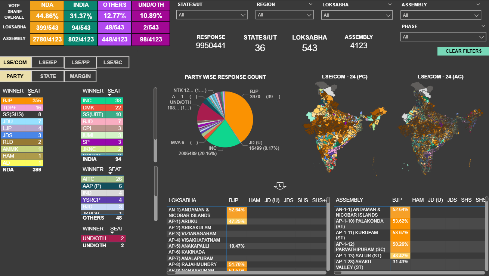
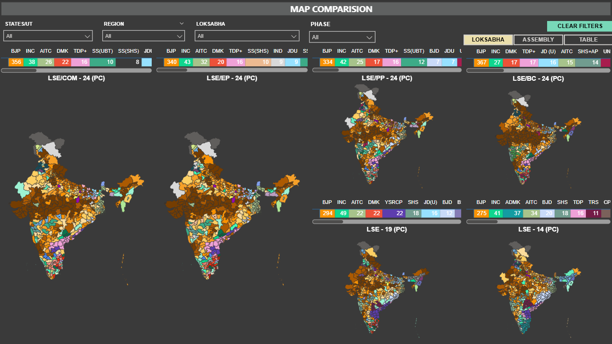
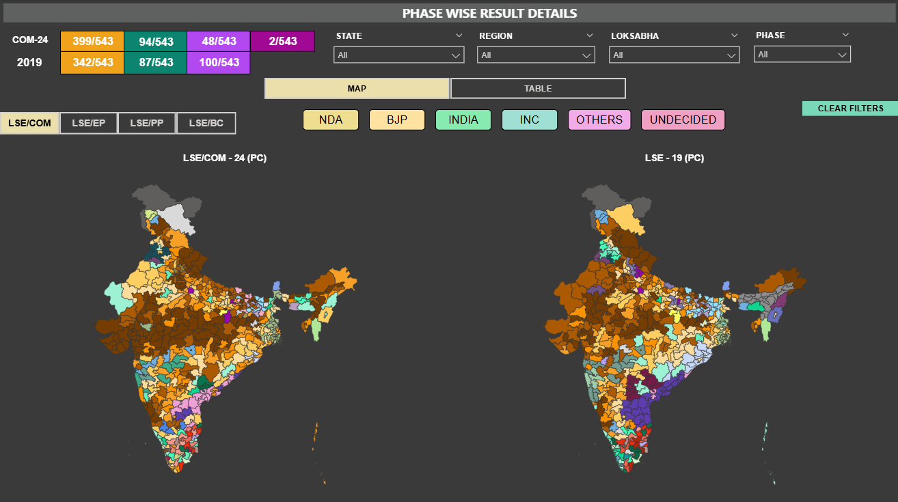
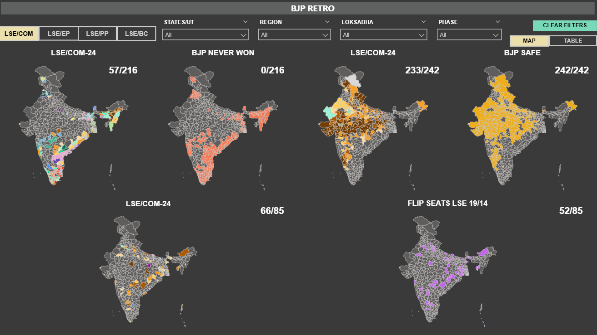
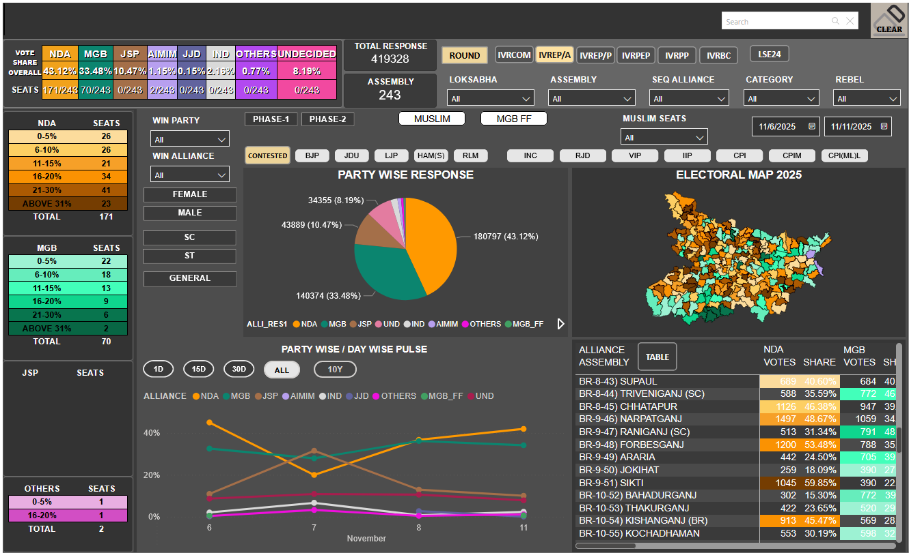

# Campaign Performance Dashboard

## Objective
Analyze daily seat count, vote share, and regional trends
to identify battleground constituencies.

## Data Used
- Survey data (sample)
- Daily P&L tables
- Demographic tables
- Historical result tables
- Region-wise seat data

## Key Learnings
- DAX optimization and performance tuning
- Handling draw cases and ranking logic
- Complex calculations using DAX
- Data modeling and relationships
- Conditional formatting for insights
- Map-based visualizations

## Business Impact
- Enabled campaign teams to track change in vote share over time
- Helped identify age-group response patterns using scatter analysis
- Improved visibility into caste-wise winning trends at seat level
- Supported faster decision-making across Punjab, Gujarat, West Bengal, and Goa

## Tools & Techniques
- Power BI
- DAX (CALCULATE, AVERAGEX, SUMMARIZE)
- Data modeling & relationships
- Conditional formatting
- Map and scatter visuals

## Dashboard Preview

## Resume Highlights
- Advanced DAX modeling for vote share, normalization, and predictive allocation
- Multi-state campaign analytics dashboards
- Business-focused insights for decision-making
