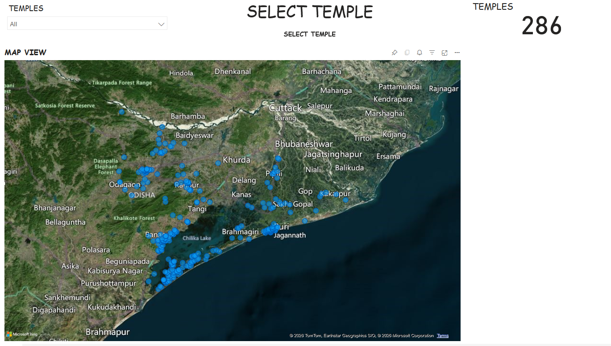
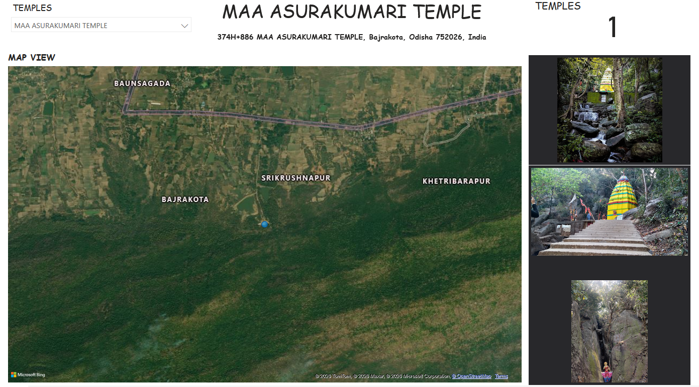

# Temple Information Dashboard (Power BI) 🛕

## 📌 Overview
The **Temple Information Dashboard** is an interactive Power BI project designed to analyze and visualize
temple-related information such as location and category with relative images.

## 🛠️ Tools & Technologies
- Power BI
- DAX
- CSV / Excel

## 📊 Key Metrics & Insights
- Total number of temples
- Temple locations
- Surrounding locations near temples

## 🗺️ Visualizations Used
- Map visual using latitude & longitude
- Cards KPIs
- Slicers
- Simple Image

## 📂 Data Model
- Single fact table containing temple attributes
- Cleaned and transformed using Power BI Power Query
- Optimized DAX measures for performance

## Dashboard Preview

