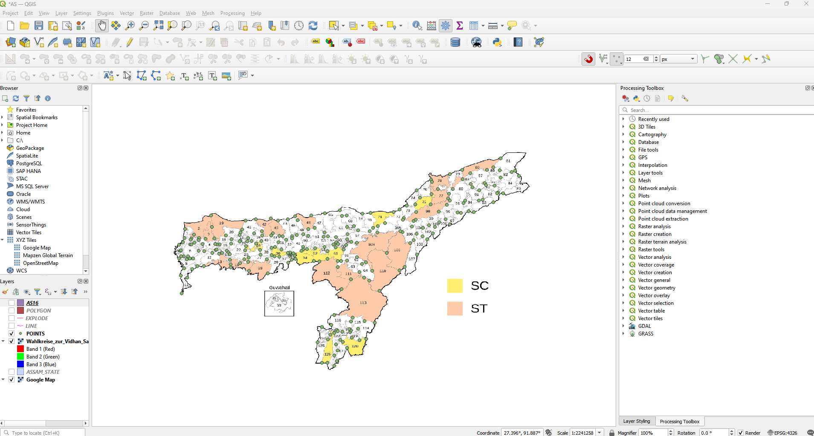
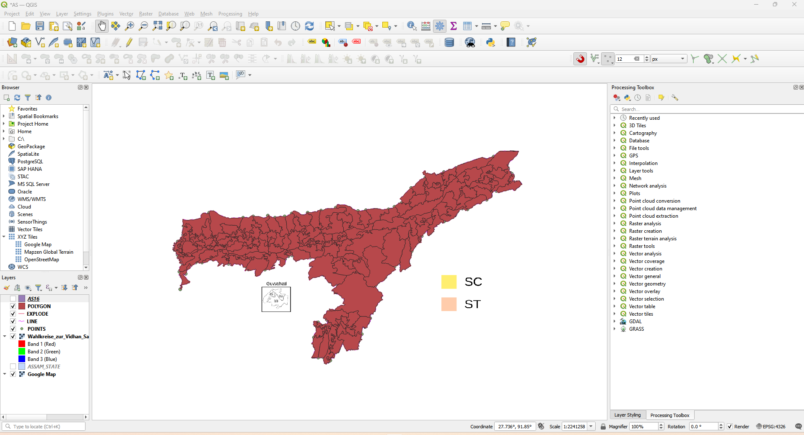

# QGIS GeoJSON Digitization Project

## 📌 Overview
This project demonstrates how an image-based map was converted into a structured GeoJSON file using **QGIS**.  
The workflow includes georeferencing, digitization, attribute creation, and joining external CSV data.

## 🗺️ Tools Used
- QGIS-OSGeo4W-3.40.14-1
- GeoJSON
- CSV

## 🧭 Workflow
1. Georeferenced a scanned / image map in QGIS
2. Digitized assembly boundaries as polygon features
3. Assigned unique `AC_NO` attributes
4. Joined external CSV data using Python
5. Exported final GeoJSON for visualization and analysis

## 📊 Output
- GeoJSON file containing Assembly locations with attributes
- QGIS project file for further edits

## 🚀 Use Cases
- Spatial data creation
- GIS learning projects
- Map-based dashboards

## Dashboard Preview

